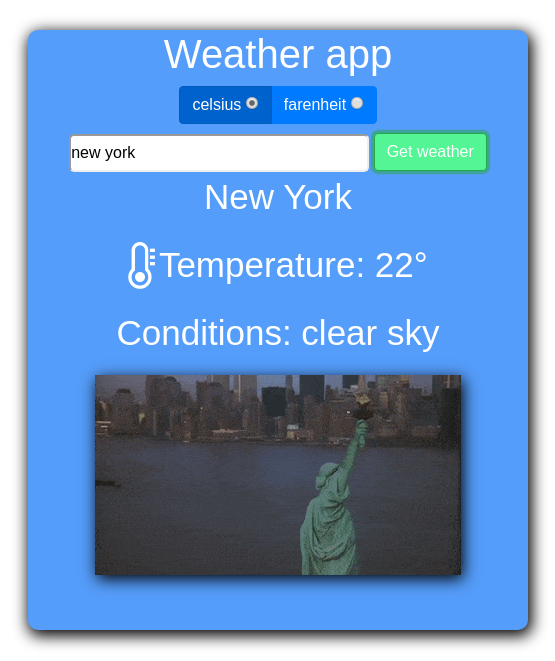

# Weather_application
This is a Weather_application using Javascript API promise. Promises are very useful when you need to work with asynchronous code. It's very common to use callbacks and promises when dealing with APIs. In this application i have used two different APIS to update the dom, all asynchronously!.

# Screenshot

# Live Demo Link
[View Live Demo](https://rawcdn.githack.com/dannisonarias/Weather_application/525113c622b00010b77abbed973e1f703f1b76fb/dist/index.html)

## Built With
- HTML & SCSS
- Bootstrap
- JavaScript/ES6
- Webpack

## Author

👤 **Dannison Arias**

- Github: [@dannisonarias](https://github.com/dannisonarias)
- Twitter: [@AriasDannison](https://twitter.com/AriasDannison)
- Linkedin: [Dannison Arias](https://www.linkedin.com/in/dannison-arias-777919190/)

## 🤝 Contributing

Contributions, issues and feature requests are welcome!

Feel free to check the [issues page](https://github.com/dannisonarias/Weather_application/issues).

## Show your support

Give a ⭐️ if you like this project!

## Acknowledgments

- Microverse
- The Odin Project

## 📝 License

This project is [MIT](./license.md) licensed.
